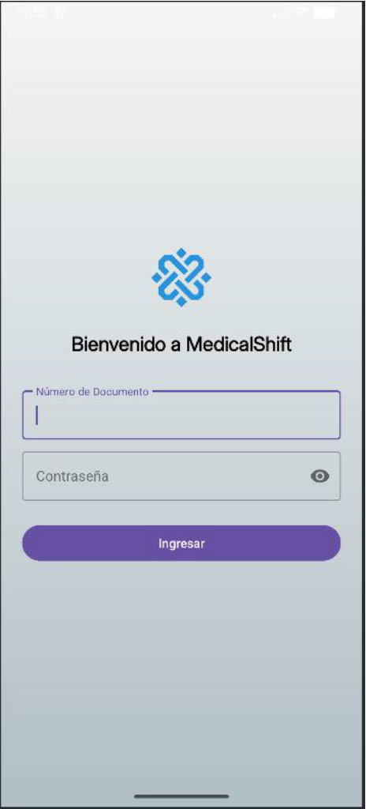
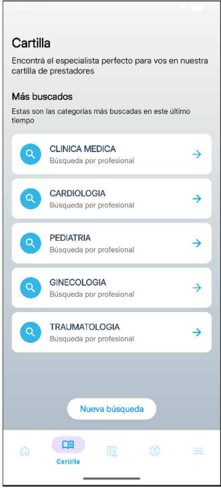

# MedicalShift

MedicalShift es una aplicación móvil desarrollada en Android Studio que permite gestionar trámites médicos, visualizar la cartilla de profesionales de salud, administrar documentos y realizar diversas gestiones relacionadas con servicios médicos. La aplicación está integrada con un backend Firebase/Express.js para almacenamiento de datos y autenticación.

---

## 📱 Descripción

MedicalShift es una aplicación completa de gestión médica que permite a los usuarios:

- **Autenticación segura** con número de documento y contraseña
- **Visualización de perfil** con datos personales actualizados desde Firestore
- **Gestión de trámites** (gestiones) médicos con seguimiento de estado
- **Subida de documentos** a Firebase Storage para diferentes tipos de gestiones
- **Visualización de cartilla médica** con búsqueda de profesionales
- **Administración de datos personales** con edición de información
- **Gestión de facturas** y pagos pendientes
- **Visualización de documentos** subidos al sistema

---

## 🔐 Credenciales de Acceso

Para acceder a la aplicación, utiliza las siguientes credenciales:

- **Número de Documento:** `40987654`
- **Contraseña:** `NewPassword456#`

---

## 🚀 Cómo Ejecutar la Aplicación

### Requisitos Previos

- **Android Studio** (versión recomendada: última estable)
- **JDK 11** o superior
- **Dispositivo Android** o **Emulador** (API 24 o superior)
- **Backend en ejecución** (ver repositorio `backend-medicalshift`)

### Pasos para Ejecutar

1. **Clonar el repositorio:**
   ```bash
   git clone https://github.com/[tu-usuario]/final-am-acn4av-acosta-cariaga-chavez.git
   cd final-am-acn4av-acosta-cariaga-chavez/medicalshift
   ```

2. **Abrir en Android Studio:**
   - Abre Android Studio
   - Selecciona "Open an Existing Project"
   - Navega a la carpeta `medicalshift`

3. **Sincronizar dependencias:**
   - Android Studio debería sincronizar automáticamente las dependencias de Gradle
   - Si no, ve a `File > Sync Project with Gradle Files`

4. **Configurar el backend:**
   - Asegúrate de que el backend esté corriendo en `http://10.0.2.2:3000` (para emulador) o la IP de tu máquina (para dispositivo físico)
   - Verifica la configuración en `RetrofitClient.java`

5. **Ejecutar la aplicación:**
   - Conecta un dispositivo Android o inicia un emulador
   - Presiona el botón "Run" (▶️) o usa `Shift + F10`

---

## 📦 Dependencias

La aplicación utiliza las siguientes dependencias principales:

### Networking y API
- **Retrofit 2.9.0** - Cliente HTTP para comunicación con el backend
- **OkHttp 4.12.0** - Cliente HTTP subyacente
- **OkHttp Logging Interceptor 4.12.0** - Logging de peticiones HTTP
- **Gson 2.10.1** - Serialización/deserialización JSON

### UI y Material Design
- **Material Components 1.10.0** - Componentes de Material Design
- **AppCompat 1.6.1** - Compatibilidad con versiones anteriores de Android
- **Activity 1.8.0** - Componentes de Activity
- **ConstraintLayout 2.1.4** - Layouts flexibles

### Testing
- **JUnit 4.13.2** - Framework de testing unitario
- **AndroidX Test Ext JUnit 1.1.5** - Extensiones de JUnit para Android
- **Espresso Core 3.5.1** - Testing de UI

### Configuración
- **Gradle 8.13.1** - Sistema de build
- **Android Gradle Plugin 8.13.1** - Plugin de Android para Gradle

Todas las dependencias están definidas en `gradle/libs.versions.toml` y `app/build.gradle.kts`.

---

## 📖 Cómo Utilizar la Aplicación

### 1. Inicio de Sesión

1. Al abrir la aplicación, verás la pantalla de **Login**
2. Ingresa tu número de documento: `40987654`
3. Ingresa tu contraseña: `NewPassword456#`
4. Presiona el botón "Iniciar Sesión"
5. Si las credenciales son correctas, serás redirigido a la pantalla principal

### 2. Pantalla Principal (Inicio)

La pantalla de inicio muestra:
- **Saludo personalizado** según la hora del día
- **Credencial digital** con tus datos personales
- **Vista previa de gestiones recientes** (últimas 3)
- **Acceso rápido a la cartilla médica**

### 3. Gestiones

En la pestaña **Gestiones** puedes:
- Ver todas tus gestiones (hasta 20 más recientes)
- Ver el estado de cada gestión (pendiente, aprobada, rechazada)
- Acceder a crear nuevas gestiones

#### Crear una Nueva Gestión

1. Presiona el botón flotante "+" o navega a **Nueva Gestión**
2. Selecciona el tipo de gestión:
   - **Oncología** - Requiere fecha de aplicación y archivo adjunto
   - **Programa Diabetes** - Requiere archivo adjunto
   - **Programa Patologías Crónicas** - Requiere archivo adjunto
   - **Medicamentos con Autorización Previa** - Requiere fecha de aplicación y archivo adjunto
3. Completa el formulario correspondiente
4. Adjunta un archivo (foto o PDF) si es requerido:
   - Presiona "Tomar Foto" para usar la cámara
   - Presiona "Adjuntar Archivo" para seleccionar un documento
5. Presiona "Solicitar" para enviar la gestión
6. La gestión se creará en Firestore y el archivo se subirá a Firebase Storage

### 4. Perfil

En la pestaña **Perfil** puedes:
- Ver tus datos personales completos
- Acceder a diferentes opciones:
  - **Mis Datos** - Ver y editar información personal
  - **Seguridad** - Configuraciones de seguridad
  - **Mis Documentos** - Ver documentos subidos al sistema
  - **Reintegros** - Ver tu CBU actual
  - **Pagar Factura** - Ver y pagar facturas pendientes
  - **Resumen de Pagos** - Historial de pagos
  - **Preguntas Frecuentes** - FAQ
  - **Asistencia al Viajero** - Información para viajeros
  - **Coberturas Especiales** - Información sobre coberturas
  - **Contacto** - Información de contacto

#### Editar Datos Personales

1. Ve a **Perfil > Mis Datos**
2. Presiona el botón "Editar" o el ícono de edición
3. Se abrirá un bottom sheet con el formulario de edición
4. Modifica los campos que desees:
   - Teléfono
   - Email
   - Estado civil
   - Dirección (calle, número, piso, departamento)
   - Localidad
   - Provincia (selector)
5. Presiona "Guardar Cambios"
6. Los datos se actualizarán en Firestore

### 5. Cartilla Médica

1. Desde la pantalla de inicio, presiona "Ver Cartilla" o navega a la pestaña **Cartilla**
2. Puedes buscar profesionales por:
   - Nombre
   - Especialidad
   - Localidad
3. Los resultados se filtrarán en tiempo real
4. Presiona sobre un profesional para ver más detalles

### 6. Mis Documentos

1. Ve a **Perfil > Mis Documentos**
2. Verás una lista de todos los documentos que has subido
3. Los documentos están organizados por fecha de subida (más recientes primero)
4. Cada documento muestra:
   - Nombre del archivo
   - Tipo de gestión asociada
   - Fecha de subida

### 7. Pagar Factura

1. Ve a **Perfil > Pagar Factura**
2. Verás las facturas pendientes de pago
3. Selecciona una factura para ver detalles
4. Sigue el proceso de pago (implementación pendiente)

---

## 🖼️ Screenshots

La aplicación incluye las siguientes pantallas principales:

### Pantalla de Login


### Pantalla de Inicio


### Pantalla de Gestiones


### Pantalla de Perfil


### Pantalla de Opciones


### Pantalla de Cartilla


---

## 🏗️ Estructura del Proyecto

```
medicalshift/
├── app/
│   ├── src/
│   │   ├── main/
│   │   │   ├── java/com/example/medicalshift/
│   │   │   │   ├── activities/          # Actividades principales
│   │   │   │   ├── fragments/            # Fragmentos para navegación
│   │   │   │   ├── models/              # Modelos de datos
│   │   │   │   ├── api/                 # Servicios de API (Retrofit)
│   │   │   │   ├── utils/               # Utilidades (TokenManager, GestionHelper, etc.)
│   │   │   │   └── adapters/            # Adaptadores para RecyclerView
│   │   │   ├── res/                     # Recursos (layouts, strings, etc.)
│   │   │   └── AndroidManifest.xml      # Configuración de la app
│   │   └── test/                        # Tests unitarios
│   └── build.gradle.kts                 # Configuración de build
├── gradle/
│   └── libs.versions.toml              # Versiones de dependencias
└── build.gradle.kts                    # Configuración del proyecto
```

---

## 🔧 Configuración Técnica

### Permisos Requeridos

La aplicación requiere los siguientes permisos (definidos en `AndroidManifest.xml`):

- `INTERNET` - Para comunicación con el backend
- `ACCESS_NETWORK_STATE` - Para verificar conectividad
- `CAMERA` - Para tomar fotos en gestiones (opcional)

### Configuración de Red

- La aplicación está configurada para permitir tráfico HTTP claro (`usesCleartextTraffic="true"`) para desarrollo
- El backend debe estar accesible en `http://10.0.2.2:3000` (emulador) o la IP de tu máquina (dispositivo físico)
- La configuración de red se encuentra en `res/xml/network_security_config.xml`

### Autenticación

- La aplicación utiliza **JWT tokens** para autenticación
- Los tokens se almacenan localmente usando `TokenManager`
- El `userId` se almacena como el número de documento del usuario
- Los tokens se incluyen en el header `Authorization: Bearer <token>` en todas las peticiones

---

## 🔄 Integración con Backend

La aplicación se comunica con un backend Express.js que utiliza Firebase:

- **Firestore** - Base de datos para usuarios, gestiones y documentos
- **Firebase Storage** - Almacenamiento de archivos subidos
- **Firebase Authentication** - Autenticación de usuarios

### Endpoints Principales

- `POST /auth/login` - Inicio de sesión
- `GET /auth/me` - Obtener datos del usuario actual
- `PUT /users/me` - Actualizar datos del usuario
- `GET /gestiones` - Listar gestiones del usuario
- `POST /gestiones` - Crear nueva gestión
- `POST /storage/gestion/{gestionId}` - Subir archivo para una gestión
- `GET /storage/documents` - Listar documentos del usuario
- `GET /facturas` - Listar facturas pendientes

---

## 🐛 Solución de Problemas

### La aplicación no se conecta al backend

1. Verifica que el backend esté corriendo
2. Verifica la IP/URL en `RetrofitClient.java`
3. Para emulador, usa `10.0.2.2:3000`
4. Para dispositivo físico, usa la IP de tu máquina en la misma red

### Error al subir archivos

1. Verifica que Firebase Storage esté configurado correctamente
2. Verifica que el bucket esté configurado en el backend
3. Revisa los logs de Logcat para ver el error específico

### Error de autenticación

1. Verifica que las credenciales sean correctas
2. Verifica que el token no haya expirado
3. Cierra sesión y vuelve a iniciar sesión

---

## 👥 Autores

### **Gabriel Hernán Acosta**

### **María del Rosario Cariaga**

---

## 📄 Licencia

Este proyecto fue desarrollado con fines académicos. Su uso está permitido para revisión, aprendizaje y mejora personal.

---

## 📝 Notas Adicionales

- La aplicación está en modo de desarrollo
- Algunas funcionalidades pueden estar en proceso de implementación
- Los datos se sincronizan en tiempo real con Firestore
- Los archivos subidos se almacenan en Firebase Storage con estructura: `gestiones/{gestionId}/{userId}/{filename}`

---

## 🔗 Enlaces Relacionados

- [Repositorio Backend](https://github.com/[tu-usuario]/backend-medicalshift)
- [Documentación de API](backend-medicalshift/docs/api-spec.md)
